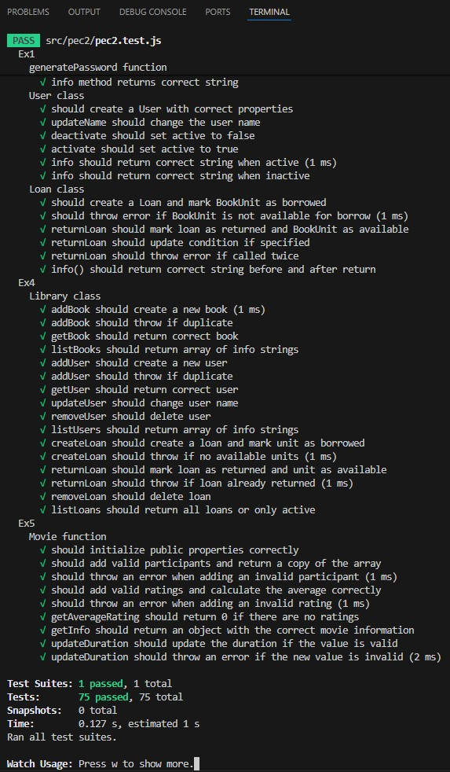

# 💻 JS OOP — Algorithms & data structures in JavaScript

<sub>🗓️ Developed in November 2025</sub>

This project contains a set of **JavaScript programming exercises** designed to practise and evaluate core language features, including input validation, algorithms, object-oriented programming, and closures.  
With the exercises included, the following competences are developed:
- Autonomous and self-directed learning.
- Analysis and synthesis of complex technical information.
- Appropriate use of JavaScript and modern development tools.
- Adaptation to evolving web technologies and professional environments.

---

## ✅ Features

- **Exercise 1 – Password Generator**: Random password generation with configurable character types (uppercase, lowercase, numbers, symbols) and validation.
- **Exercise 2 – Spiral Generator**: Generates an ASCII spiral pattern inside a 2D matrix using block characters.
- **Exercise 3 – Library Class Model**: Full OOP implementation of a library system with abstract classes, inheritance, and class interaction (`LibraryItem`, `Book`, `BookUnit`, `User`, `Loan`).
- **Exercise 4 – Library Manager**: Central `Library` class managing books, users, and loans with full CRUD operations.
- **Exercise 5 – Movie Constructor**: Function constructor combining closures, privileged methods, and prototype-based methods.
- **Test-driven**: All exercises are verified via automated tests using **Jest**.

---

## 🛠 Installation & Setup

### 0. Prerequisites
Make sure you have installed:
- **Node.js** (recommended: LTS version)
- **npm** (comes with Node)

Check versions:
```bash
node -v
npm -v
```

### 1. Clone the repository
```bash
git clone https://github.com/marcturu/js-oop.git
cd js-oop
```

### 2. Install dependencies
```bash
npm install
```

### 3. Run the tests
```bash
npm t
```
The test environment includes a menu (accessible by pressing the `w` key) that allows you to run tests selectively. For example, pressing `a` lets you manually re-run all tests, and pressing `f` lets you re-run only the tests that have failed.

The test runner will watch for changes in `src/pec2/pec2.js` and re-run automatically on every save.

### 4. Check the statements
Take a look at the statements in `README_ca.md` or `README_es.md` to understand the exercise implementations.

---

## 📂 Project Structure

```
README_ca.md  ← Statement in catalan
README_es.md  ← Statement in spanish
src/
└── pec2/
    ├── pec2.js        ← Solution implemented
    └── pec2.test.js   ← Test file
```

---

## 📷 Screenshots 

### Tests passed:


---

## ⚖️ Copyright & License

© 2025 Marc Turu Roca. All rights reserved.

This project and its contents are the exclusive intellectual property of Marc Turu Roca.  
All rights reserved. No part of this project may be copied, modified, distributed, or used without prior written permission from the author.
